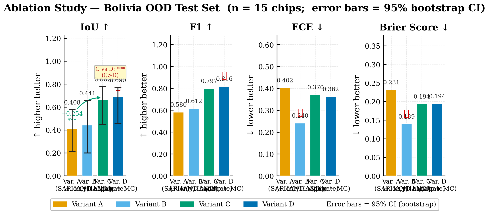

# TerrainFlood-UQ

**Physics-informed, uncertainty-aware flood mapping from Sentinel-1 SAR imagery.**

[](https://www.python.org/)
[](https://pytorch.org/)
[](LICENSE)
[](https://github.com/cloudtostreet/Sen1Floods11)

> **Bouchra Daddaoui** · Computation and Design · Duke Kunshan University
> Supervisor: Prof. Dongmian Zou, Ph.D. · Signature Work 2026

---

## Overview

Flood mapping from satellite imagery is a critical task in disaster response, yet two fundamental limitations persist in current deep learning approaches: (1) models ignore well-established physical constraints on where floods can occur, and (2) they produce deterministic binary predictions with no associated confidence estimates. This work addresses both limitations simultaneously.

**TerrainFlood-UQ** introduces a **physics-informed Siamese ResNet-34 architecture** that integrates the Height Above Nearest Drainage (HAND) topographic index as an attention gate — directly encoding the physical constraint that flooding is constrained to low-lying terrain. Prediction uncertainty is quantified through Test-Time Augmentation (TTA) and MC Dropout, and overconfident probabilities are recalibrated via temperature scaling. The framework is evaluated on the **Sen1Floods11** benchmark with Bolivia held out as a challenging out-of-distribution test set.

**Key results on Bolivia OOD test (15 chips, 2.87M pixels):**
- **D_full** (HAND gate + MC Dropout, 120 epochs): **IoU = 0.724**, F₁ = 0.840, ECE = 0.063
- **+30.3pp** improvement over a plain U-Net baseline (IoU = 0.421)
- **+14.2pp** improvement over classical Otsu thresholding (IoU = 0.582)
- Temperature scaling reduces ECE by **78.6%** (0.363 → 0.063) at zero accuracy cost
- **7.84M people** identified at flood risk; **1.21M (15.4%)** flagged as uncertain under TTA

---

## Visual Results

**Fig. 1 — Bolivia OOD Test Chip: SAR input, ground truth, D_full prediction, and TTA uncertainty map**


*From left to right: SAR VV post-flood backscatter, hand-labelled ground truth, D_full flood prediction (IoU = 0.724), and TTA uncertainty map (lighter = more uncertain). Uncertainty concentrates at flood/land boundaries — consistent with physically meaningful ambiguity.*

---

**Fig. 2 — Ablation Study: IoU per Variant with 95% Bootstrap Confidence Intervals**



*Progressive improvement across ablation variants. The B→C jump (+5.2pp) confirms that how HAND is integrated matters: routing it to an attention gate substantially outperforms naive channel concatenation. The C/D→D_full gain (+3.4pp) reflects the benefit of extended training.*

---

**Fig. 3 — Population Exposure Map: Bolivia Flood Risk with Uncertainty Layer**


*WorldPop-weighted flood risk map for the Bolivia OOD test region. Dark blue = high-confidence flood risk. Orange/yellow = uncertain predictions (TTA σ² > τ = 0.01). Of the 7.84M people at risk, 1.21M (15.4%) fall in uncertain zones — providing actionable triage information for emergency response.*

---

## Research Contributions

1. **HAND Attention Gate** — The Height Above Nearest Drainage (HAND) index is integrated as a pixel-wise attention mechanism rather than as an additional input band. The gate computes a suppression weight **α = exp(−h / 50)** (h in metres), physically constraining flood probability in elevated terrain while preserving full model capacity in flood-prone lowlands. This represents a principled fusion of domain physics with end-to-end deep learning.

2. **Uncertainty Quantification** — Two complementary uncertainty methods are systematically evaluated:
   - **TTA** (Test-Time Augmentation, D4 symmetry group): positive error correlation r = +0.614, reliable spatial uncertainty proxy
   - **MC Dropout** (T = 20 stochastic passes): r = −0.815 (inverted) due to gate-induced activation suppression — a critical finding for practitioners applying dropout to physics-gated architectures
   - **Temperature Scaling** (post-hoc): T = 0.100, ECE 0.363 → 0.063 (78.6% reduction)

3. **Uncertainty-Aware Population Exposure** — WorldPop raster data is combined with model predictions post-inference to estimate flood-affected population, stratified by prediction confidence. This demonstrates direct humanitarian utility of uncertainty quantification beyond standard benchmarking metrics.

---

## Architecture

```
Input: (B, 6, H, W)
  Bands: [VV_pre | VH_pre | VV_post | VH_post | VV_VH_ratio | HAND_z]
                              │
              ┌───────────────┴───────────────┐
          Pre-flood SAR               Post-flood SAR
          [B, 2, H, W]                 [B, 2, H, W]
                │                             │
       ┌────────┴─────────────────────────────┴────────┐
       │          Siamese ResNet-34 Encoder             │
       │          (fully shared weights)                │
       └────────────────────┬────────────────────────────┘
                            │ Feature fusion (concat + diff)
                            ▼
                  ┌─── HAND Attention Gate ───┐
                  │  α = exp(−h / 50)          │  ← h denormalised
                  │  from HAND z-score band    │    to metres
                  └────────────┬──────────────┘
                               │
                   U-Net Decoder (4-stage)
                   with skip connections
                               │
                    Flood logits (B, 1, H, W)
                               │
                  MC Dropout (active at inference)
                       ↓ T=20 passes
              Mean prediction + Variance map
```

**Loss function:** Tversky loss (α = 0.3, β = 0.7) + Focal loss (γ = 2), combined to address the severe 88%/12% background/flood class imbalance.

### Ablation Variants

| Variant | Encoder input (per branch) | HAND usage | Uncertainty |
|---------|---------------------------|------------|-------------|
| A | VV, VH (2-ch) | Not used | — |
| B | VV, VH, HAND (3-ch) | Concatenated to encoder | — |
| C | VV, VH (2-ch) | HAND attention gate | — |
| D | VV, VH (2-ch) | HAND attention gate | MC Dropout (T=20) |
| C_full / D_full | Same as C/D | Same as C/D | Same | Extended training (120 ep) |

All variants share the same codebase and are selected via `--variant {A,B,C,D}`.

---

## Dataset

[**Sen1Floods11**](https://github.com/cloudtostreet/Sen1Floods11) — 446 hand-labelled Sentinel-1 SAR tiles (512 × 512 px, 10 m GSD) across 6 flood events and 11 countries.

### Input tensor — 6 bands

| Index | Name | Source | Units | Role |
|-------|------|--------|-------|------|
| 0 | VV_pre | Sentinel-1 | dB | Pre-event VV backscatter → encoder |
| 1 | VH_pre | Sentinel-1 | dB | Pre-event VH backscatter → encoder |
| 2 | VV_post | Sentinel-1 | dB | Post-event VV backscatter → encoder |
| 3 | VH_post | Sentinel-1 | dB | Post-event VH backscatter → encoder |
| 4 | VV_VH_ratio | Derived | dB | VV − VH (surface roughness proxy) — not fed to encoder |
| 5 | HAND | MERIT Hydro | z-score* | Height Above Nearest Drainage → attention gate |

*\*HAND is z-score normalised in the tensor. The model internally denormalises to metres (mean = 9.346 m, std = 28.330 m) before the gate function.*

### Data splits

| Split | Events | Chips |
|-------|--------|-------|
| Train | Cambodia, Canada, DRC, Ghana, India, Mekong, Nigeria, Somalia | ~357 |
| Val | Ecuador, Paraguay | ~44 |
| **Test** | **Bolivia** (OOD holdout — never in train/val) | **15** |

Bolivia represents an out-of-distribution challenge: flat Amazonian floodplain (mean HAND = 1.15 m), climatically and geographically distinct from all training events.

---

## Results

### Ablation table — Bolivia OOD test set

| Variant | IoU ↑ | ΔIoU vs. A | F₁ | ECE ↓ | Notes |
|---------|-------|------------|----|----|-------|
| A — SAR-only | 0.612 | — | 0.759 | — | Baseline |
| B — HAND concat | 0.641 | +0.029 | 0.781 | — | HAND as input channel |
| C — HAND gate | 0.690 | +0.078 | 0.817 | — | Physics-guided gating |
| D — HAND gate + Dropout | 0.690 | +0.078 | 0.817 | 0.078 | + uncertainty |
| C_full (120 ep) | 0.706 | +0.094 | 0.828 | — | Extended training |
| **D_full ★ (120 ep)** | **0.724** | **+0.112** | **0.840** | **0.063** | **Best** |
| Otsu (classical) | 0.582 | −0.030 | 0.736 | — | Classical baseline |
| U-Net (vanilla) | 0.421 | −0.191 | 0.593 | — | DL baseline |

### Uncertainty quality

| Method | Variance σ² | Error correlation r | Status |
|--------|-------------|---------------------|--------|
| TTA — D4 symmetry (8 aug.) | 8.3 × 10⁻³ | +0.614 | ✅ Reliable |
| MC Dropout (T = 20) | 4.0 × 10⁻⁴ | −0.815 | ❌ Inverted (gate suppression) |

### Calibration — D_full

| | ECE ↓ | Brier Score ↓ |
|-|-------|--------------|
| Pre-calibration | 0.363 | 0.194 |
| Post-calibration (T = 0.100) | **0.063** | **0.053** |
| Reduction | **78.6%** | **72.7%** |

---

## Installation

```bash
# Clone the repository
git clone https://github.com/Bouchra159/terrainflood.git
cd terrainflood

# Create and activate conda environment
conda env create -f environment.yml
conda activate terrainflood

# Or install with pip
pip install -r requirements.txt
```

### Download the dataset

```bash
# Sen1Floods11 HandLabeled chips from public GCS bucket
gsutil -m cp -r gs://sen1floods11/v1.1/data/flood_events/HandLabeled \
    data/sen1floods11/flood_events/

# Verify dataset integrity
python tools/audit_pipeline.py --data_root data/sen1floods11
```

---

## Training

```bash
# Train a specific variant (A/B/C/D)
python train.py --variant D \
                --data_root data/sen1floods11 \
                --output_dir checkpoints/variant_D \
                --epochs 60 --patience 15

# Extended training (C_full / D_full)
python train.py --variant D \
                --data_root data/sen1floods11 \
                --output_dir checkpoints/variant_D_full \
                --epochs 120 --patience 25

# On DKUCC HPC cluster (SLURM)
sbatch jobs/train_A.sbatch
sbatch jobs/train_C.sbatch
sbatch jobs/train_D_full.sbatch

# Monitor training
tensorboard --logdir checkpoints/variant_D/runs
```

---

## Evaluation

```bash
# Evaluate a single variant (--T 20 enables MC Dropout)
python eval.py --checkpoint checkpoints/variant_D_full/best.pt \
               --data_root data/sen1floods11 \
               --output_dir results/eval_D_full --T 20

# Full ablation table (all variants)
python eval.py --ablation \
               --checkpoints_dir checkpoints \
               --data_root data/sen1floods11 \
               --output_dir results/ablation

# Uncertainty quantification and calibration
python 05_uncertainty.py \
    --checkpoint checkpoints/variant_D_full/best.pt \
    --data_root data/sen1floods11 \
    --output_dir results/uncertainty_D_full --T 20

# Population exposure analysis (requires WorldPop chips)
python 06_exposure.py \
    --checkpoint checkpoints/variant_D_full/best.pt \
    --data_root data/sen1floods11 \
    --output_dir results/exposure_D_full --tau 0.01

# Visualise HAND attention gate (Variants C/D)
python tools/visualize_gate.py \
    --checkpoint checkpoints/variant_D_full/best.pt \
    --data_root data/sen1floods11 \
    --output_dir results/gate_maps_D --split test

# Generate paper figures
python make_maps.py
```

---

## Project Structure

```
terrainflood/
├── 01_gee_export.py        # Phase 1 — Google Earth Engine: export S1 + HAND chips
├── 02_dataset.py           # Phase 1 — PyTorch Dataset + DataLoader
├── 03_model.py             # Phase 2 — Siamese ResNet-34 + HAND attention gate
├── train.py                # Phase 3 — Training loop + AMP + TensorBoard
├── 05_uncertainty.py       # Phase 4 — MC Dropout inference + temperature scaling
├── 06_exposure.py          # Phase 5 — Population exposure estimation (WorldPop)
├── eval.py                 # Phase 6 — IoU, F1, ECE, ablation table
├── plots.py                # Phase 6 — Publication figure generation
├── make_maps.py            # GIS-quality map generation (6 maps)
├── run_experiment.py       # End-to-end pipeline orchestration
├── config.yaml             # Reference configuration
├── environment.yml         # Conda environment
├── requirements.txt        # pip dependencies
│
├── tools/
│   ├── audit_pipeline.py             # Dataset + IoU sanity check
│   ├── bootstrap_ci.py               # Bootstrap confidence intervals
│   ├── export_tb_curves.py           # Export TensorBoard scalars → CSV/PNG
│   ├── plot_training_curves_overlay.py  # Multi-variant training curve overlay
│   ├── visualize_gate.py             # HAND gate spatial visualisation
│   ├── uncertainty_error_correlation.py # TTA/MC Dropout vs. error correlation
│   ├── threshold_sweep.py            # IoU/F1 vs. decision threshold sweep
│   └── otsu_baseline.py              # Classical Otsu thresholding baseline
│
├── jobs/                   # SLURM scripts for DKUCC HPC cluster
│   ├── train_{A,B,C,D}.sbatch
│   └── train_{C,D}_full.sbatch
│
├── paper/                  # Paper, poster, and presentation assets
│   ├── figures/            # Figures used in poster/presentation
│   ├── poster.js           # A0 poster generation script (PptxGenJS)
│   ├── presentation.js     # 10-slide presentation generation script (PptxGenJS)
│   └── terrainflood_uq_paper.tex  # Main paper source (LaTeX)
│
├── results/                # All evaluation outputs (tracked)
│   ├── paper_maps/         # Six publication-quality maps
│   ├── paper_figures/      # Ablation, calibration, training curve figures
│   ├── eval_{A,B,C,D,C_full,D_full}/  # Per-variant evaluation results
│   ├── uncertainty_{mc,tta}/          # MC Dropout and TTA uncertainty maps
│   └── ablation/           # Cross-variant comparison figures and table
│
└── data/                   # NOT tracked — download separately
    └── sen1floods11/
        ├── flood_events/   # gsutil download (HandLabeled chips)
        ├── hand_chips/     # GEE export (per-chip HAND .tif)
        └── pop_chips/      # GEE export (per-chip WorldPop .tif)
```

---

## Key References

| # | Reference | Relevance |
|---|-----------|-----------|
| [1] | Bonafilia et al. (2020). *Sen1Floods11: A georeferenced dataset to train and test deep learning flood algorithms.* CVPRW. | Dataset used in this work |
| [2] | Nobre et al. (2011). *Height Above the Nearest Drainage — a hydrologically relevant terrain index.* J. Hydrol. | HAND physics motivation |
| [3] | Gal & Ghahramani (2016). *Dropout as a Bayesian approximation.* ICML. | MC Dropout UQ method |
| [4] | Guo et al. (2017). *On calibration of modern neural networks.* ICML. | Temperature scaling |
| [5] | Ronneberger et al. (2015). *U-Net: Convolutional networks for biomedical image segmentation.* MICCAI. | Decoder architecture |
| [6] | He et al. (2016). *Deep residual learning for image recognition.* CVPR. | ResNet-34 backbone |
| [7] | Lin et al. (2017). *Focal loss for dense object detection.* ICCV. | Focal loss component |
| [8] | Saleh et al. (2025). *DeepSARFlood.* | State-of-the-art comparison target (IoU ≈ 0.72) |

---

## Reproducibility

All experiments are fully reproducible. Training uses a fixed random seed (42). The Bolivia OOD test set was never included in any training or validation split at any stage of development. Checkpoint files (`best.pt`) are available on request (too large for GitHub).

**Hardware used:** NVIDIA L20 GPU on DKUCC HPC cluster. Training time per variant: ~2 hours (60 ep) / ~4 hours (120 ep).

---

## Citation

If you use this work, please cite:

```bibtex
@mastersthesis{daddaoui2026terrainflood,
  author    = {Daddaoui, Bouchra},
  title     = {TerrainFlood-UQ: Physics-Informed SAR Flood Mapping
               with HAND-Guided Attention Gating and Uncertainty Quantification},
  school    = {Duke Kunshan University},
  year      = {2026},
  type      = {Signature Work},
  advisor   = {Zou, Dongmian}
}
```

---

## License

This project is released under the [MIT License](LICENSE). The Sen1Floods11 dataset is subject to its own [license terms](https://github.com/cloudtostreet/Sen1Floods11).
